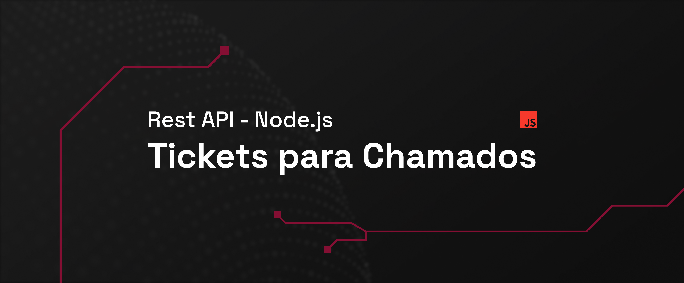

<div align="center">
  
</div>

<br>
<br>

# 🎟️ API de Tickets de Suporte

API RESTful desenvolvida com Node.js para gerenciamento de chamados de suporte técnico. Este projeto faz parte de uma jornada de aprendizado, onde foram aplicados conceitos de rotas dinâmicas, controllers, middlewares e persistência de dados local com JSON

## ✨ Funcionalidades

- ✅ Cria novo ticket de suporte
- 📋 Lista todos os tickets
- 🔄 Atualiza informações de um ticket
- 🟡 Atualiza o **status** do chamado
- ❌ Remove um ticket
- ⚙️ Rotas dinâmicas com manipulação de parâmetros e queries


## 🛠️ Tecnologias Utilizadas

- Node.js (JavaScript)
- Rotas HTTP nativas (sem frameworks)
- Modularização por controllers e middlewares
- Persistência em arquivo JSON (db.json)

## 📌 Exemplos de Rotas

| Método | Rota                        | Ação                    |
|--------|-----------------------------|-------------------------|
| GET    | `/tickets`                  | Listar todos os tickets |
| POST   | `/tickets`                  | Criar um novo ticket    |
| PUT    | `/tickets/:id`              | Atualizar ticket        |
| PATCH  | `/tickets/:id/status`       | Atualizar status        |
| DELETE | `/tickets/:id`              | Remover ticket          |

## ▶️ Como Rodar Localmente

1. **Clone o repositório:**
```bash
git clone https://github.com/seuusuario/api-ticket-suporte.git
cd api-ticket-suporte
```

2. **Instale as dependências:**
```bash
npm install
```

3. **Inicie o servidor:**
```bash
npm run dev
```

4. Utilize ferramentas como Postman, Insomnia ou similares para testar as rotas da API

## 🎓 Objetivos Educacionais

Este projeto teve como foco o aprendizado de

- Estruturação de uma API RESTful sem frameworks
- Organização de código com controllers e middlewares
- Criação de rotas customizadas
- Leitura e escrita em arquivos `.json` como base de dados
- Execução com `node --watch` para reload automático
