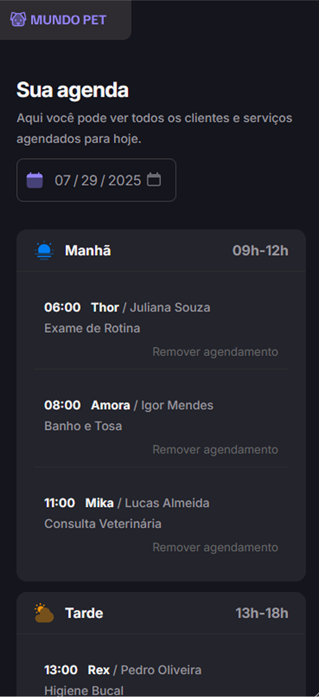
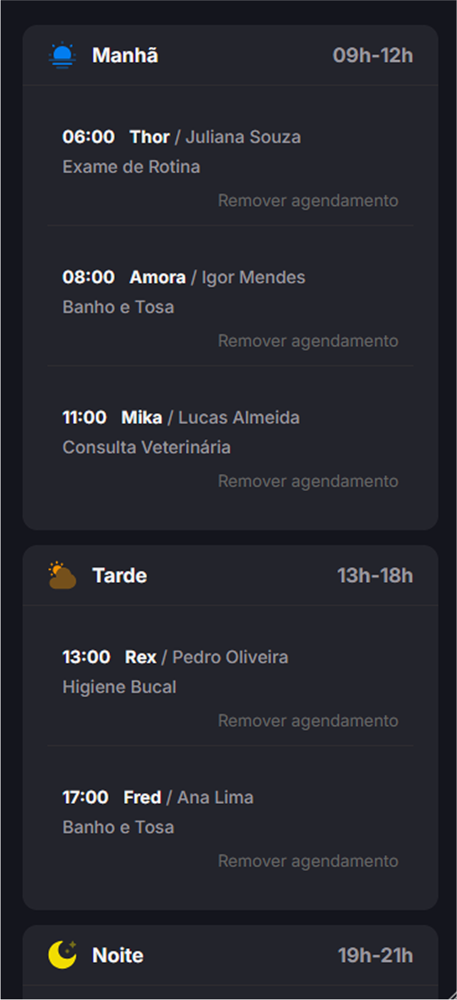
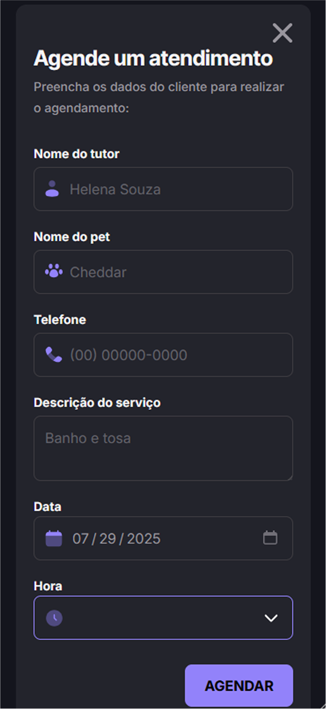

<div align="center">
  
</div>

<br>

Aplicação web de agendamento para serviços de petshop. O objetivo é simular uma experiência simples e intuitiva de agendamento de serviços para pets, ao mesmo tempo em que serve como projeto de aprendizado em tecnologias como JavaScript, manipulação de datas, utilização de banco de dados local com JSON Server e configuração de ambientes com Webpack e Babel


## 🚀 Funcionalidades

- 📆 Agendamento de serviços para pets
- ⏰ Seleção de data e horário
- 📱 Interface responsiva e amigável

## 🛠️ Tecnologias Utilizadas

- **HTML + CSS + JavaScript**
- **Webpack** – Empacotador de módulos
- **Babel** – Transpilador ES6+
- **Day.js** – Manipulação de datas
- **JSON Server** – API fake para simulação de backend

## 🧪 Scripts Disponíveis

```bash
# Iniciar o ambiente de desenvolvimento com Webpack Dev Server
npm run dev

# Build para produção
npm run build

# Iniciar servidor fake (JSON Server) na porta 3333
npm run server
```

## 🧑‍💻 Rodando o projeto localmente

Siga os passos abaixo para executar o Mundo Pet no seu ambiente local:

1. **Clone o repositório**
```bash
git clone https://github.com/seuusuario/mundopet.git
cd mundopet
```

2. **Instale as dependências**
```bash
npm install
```

3. **Inicie o servidor de dados (JSON Server)**
```bash
npm run server
```

4. **Em outro terminal, inicie o servidor de desenvolvimento**
```bash
npm run dev
```

## 📸 Pré-visualização (Mobile)

<div style="display: flex; gap: 16px;">
  
  
  
</div>


## 🙏 Créditos

- Projeto idealizado por [Rocketseat](https://rocketseat.com.br) usado para fins educacionais
